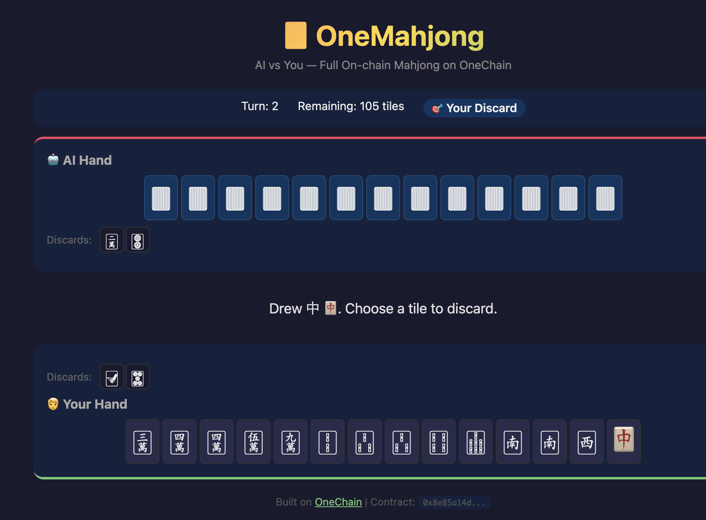

# 🀄 OneMahjong — AI Mahjong on OneChain

**OneMahjong** is a full on-chain 2-player Mahjong game where you play against an AI opponent. Game results, scores, and winning hands (Yaku) are recorded as on-chain objects on OneChain, making every victory a permanent, verifiable achievement.

**Live Demo:** [onemahjong.pages.dev](https://onemahjong.pages.dev)



## Features

- **2-Player Mahjong vs AI** — Play against an intelligent AI that evaluates tile connectivity for optimal discards
- **On-chain Game Records** — Every game result is stored as a Move object on OneChain
- **Yaku NFT Minting** — Win with a valid Yaku and mint it as a collectible NFT (e.g., "七対子", "清一色")
- **Player Profiles** — On-chain stats tracking: wins, losses, highest score
- **Full Yaku Detection** — Supports Tsumo, Tanyao, Toitoi, Chitoitsu, Honitsu, Chinitsu, Honroutou, Yakuhai, and more

## Architecture

```
┌─────────────────┐     ┌──────────────────┐     ┌─────────────────┐
│   Frontend      │     │   Game Engine    │     │   OneChain      │
│   (Vite + TS)   │────▶│   (TypeScript)   │────▶│   (Move)        │
│                 │     │                  │     │                 │
│  Mahjong UI     │     │  Tile Logic      │     │  PlayerProfile  │
│  Tile Rendering │     │  Yaku Detection  │     │  GameResult     │
│  User Input     │     │  AI Strategy     │     │  YakuNFT        │
└─────────────────┘     └──────────────────┘     └─────────────────┘
```

## Tech Stack

| Layer | Technology |
|-------|-----------|
| Smart Contract | Move (Sui-compatible, OneChain) |
| Frontend | Vite + TypeScript (Vanilla) |
| AI Opponent | Tile connectivity heuristic engine |
| Deployment | OneChain Testnet |

## Smart Contract

**Package ID:** `0x8e85a14d396a17f396af72577e44e579e761b988a66477219cecb4577c417c31`

### Entry Functions

| Function | Description |
|----------|-------------|
| `create_profile` | Create a new player profile with stats tracking |
| `record_game` | Record game result, update stats, and mint Yaku NFT |

### On-chain Objects

| Object | Description |
|--------|-------------|
| `PlayerProfile` | Player stats: wins, losses, total games, highest score |
| `GameResult` | Individual game record with score, hand, and yaku |
| `YakuNFT` | Collectible NFT minted for each winning Yaku hand |

## Yaku (Winning Hands)

| Yaku | Japanese | Han | Description |
|------|----------|-----|-------------|
| Tsumo | ツモ | 1 | Self-draw win |
| Tanyao | 断么九 | 1 | All simples (no terminals/honors) |
| Yakuhai | 役牌 | 1 | Dragon triplet |
| Toitoi | 対々和 | 2 | All triplets |
| Chitoitsu | 七対子 | 2 | Seven pairs |
| Honroutou | 混老頭 | 2 | All terminals and honors |
| Honitsu | 混一色 | 3 | Half flush |
| Chinitsu | 清一色 | 6 | Full flush |
| Tsuuiisou | 字一色 | 13 | All honors (Yakuman!) |

## Getting Started

### Prerequisites

- Node.js 18+
- OneChain CLI (`one`)

### Run Locally

```bash
cd frontend
npm install
npm run dev
```

### Deploy Smart Contract

```bash
one client switch --env testnet
one client faucet
one move build
one client publish --gas-budget 500000000 --skip-dependency-verification
```

## Hackathon

Built for **OneHack 3.0: AI & Game Edition** on [DoraHacks](https://dorahacks.io/hackathon/onehackathon).

- **Track:** GameFi + AI-powered Applications
- **Chain:** OneChain (Move-based)

## License

MIT
